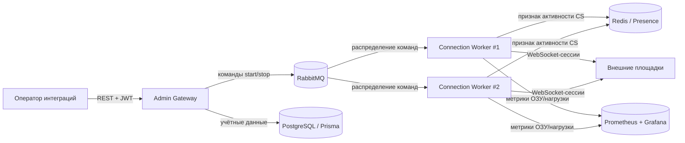

# System Discovery: Платформа интеграции с внешними площадками

Верхнеуровневая проработка системы: намерения, цели, акторы, бизнес- и функциональные
требования и границы платформы, которая держит тысячи постоянных real-time соединений
к внешним торговым площадкам от имени продавцов ритейл-компании.

---

## Навигация

- [Контекст и намерение](#контекст-и-намерение)
- [Глоссарий](#глоссарий)
- [Цели системы](#цели-системы)
- [Акторы](#акторы)
- [Бизнес-требования](#бизнес-требования)
- [Функциональные требования](#функциональные-требования)
- [Архитектура](#архитектура)
- [Ключевые инженерные решения](#ключевые-инженерные-решения)
- [Границы и допущения](#границы-и-допущения)
- [Версионирование](#версионирование)

---

## Контекст и намерение

Ритейл-компания продаёт товары через десятки внешних торговых площадок (маркетплейсы,
партнёрские витрины, агрегаторы доставки). Многие из них требуют не запросов «по расписанию»,
а постоянного соединения: площадка присылает события об изменении заказа, статуса доставки,
остатка и цены в реальном времени и ждёт от продавца ответных подтверждений и heartbeat.

Каждый продавец компании имеет свои учётные данные и свой сетевой доступ (прокси) к каждой
площадке. Число «продавец × площадка» — тысячи одновременных соединений. Держать их в одном
монолите нельзя: он не помещается по памяти и падает целиком при перезапуске.

> **Намерение:** дать бизнесу единую управляемую точку, которая надёжно держит все соединения
> к площадкам, горизонтально масштабируется под рост числа продавцов и даёт наблюдаемость нагрузки.

---

## Глоссарий

Термины вводятся здесь один раз и далее по тексту используются в канонической форме
(см. правила [terminology.md](../.claude/terminology.md)).

- Платформа интеграции с площадками (Marketplace Integration Gateway, MIG) — вся система.
- Административный шлюз (Admin Gateway, AG) — приложение `deepin-backend-admin`: REST-API,
  аутентификация, хранение учётных данных, оркестрация сессий.
- Воркер соединений (Connection Worker, CW) — приложение `deepin-backend-microservices`:
  держит сами соединения к площадкам.
- Продавец-аккаунт (Subscriber Account, SA) — учётная запись продавца на площадке
  (в коде — `abonent`).
- Внешняя площадка (External Channel, EC) — маркетплейс или партнёрский сервис.
- Сессия соединения (Connection Session, CS) — одно живое соединение `SA × EC`.
- Реестр присутствия (Presence Registry, PR) — Redis-кэш с признаком «сессия запущена»
  и её размещением по воркерам.
- Шина команд и событий (Message Bus, MB) — RabbitMQ между AG и CW.

---

## Цели системы

- **GOAL-1.** Держать тысячи одновременных CS к EC стабильно и без потери событий.
- **GOAL-2.** Горизонтально масштабировать нагрузку соединений добавлением экземпляров CW.
- **GOAL-3.** Дать AG единую точку управления: запуск, остановка и статус любой CS продавца.
- **GOAL-4.** Обеспечить наблюдаемость: нагрузка и потребление ОЗУ по каждому CW, SLA соединений.
- **GOAL-5.** Изолировать сбой одной CS или одного CW от остальных.

---

## Акторы

| Актор | Роль | Взаимодействие с MIG |
|-------|------|----------------------|
| Оператор интеграций | Сотрудник, управляющий подключениями продавцов | Через REST-API AG: заводит SA, запускает и останавливает CS |
| Продавец (Seller) | Владелец товаров и учётных данных на EC | Предоставляет учётные данные и прокси, потребляет результат синхронизации |
| Внешняя площадка (EC) | Внешняя система | Открывает и обслуживает CS, шлёт события и heartbeat |
| SRE / DevOps | Эксплуатация платформы | Читает метрики Prometheus, дашборды Grafana, управляет масштабированием CW |

---

## Бизнес-требования

- **BR-001.** Соединения к EC не должны теряться при перезапуске или сбое отдельного CW.
- **BR-002.** Добавление продавцов не должно требовать переписывания системы — только рост CW.
- **BR-003.** Учётные данные и прокси продавцов хранятся централизованно и под аутентификацией.
- **BR-004.** Бизнес должен видеть текущую нагрузку и «здоровье» интеграций в реальном времени.
- **BR-005.** Повторный запуск уже активной CS недопустим — двойное соединение ломает EC-сессию.

---

## Функциональные требования

- **FR-001.** AG предоставляет REST-API управления SA (создание, поиск, обновление, удаление).
- **FR-002.** AG аутентифицирует операторов по JWT (access/refresh токены).
- **FR-003.** AG публикует в MB команды `start`/`stop` для конкретной CS.
- **FR-004.** CW подписан на MB и открывает/закрывает CS по командам, распределяя их между экземплярами.
- **FR-005.** CS реализована конечным автоматом состояний (offline ↔ online) с failsafe-переподключением.
- **FR-006.** Перед запуском CS проверяется PR: если сессия уже активна — повторный запуск отклоняется.
- **FR-007.** CW экспортирует в Prometheus метрики нагрузки и потребления ОЗУ на экземпляр.
- **FR-008.** Учётные данные площадок (project-creeds) и прокси хранятся в БД через Prisma.

---

## Архитектура

Платформа — Nx-монорепозиторий из двух NestJS-приложений: AG как точка управления и CW как
масштабируемый пул воркеров. Обмен между ними — только через MB, что развязывает их по времени
и позволяет запускать произвольное число CW.

---

## Ключевые инженерные решения

Раздел для рассказа на собеседовании — что нетривиального внутри.

- **Разделение управления и нагрузки.** AG не держит соединений; вся память под CS живёт в CW.
  Падение или деплой AG не рвёт соединения к EC.
- **Горизонтальное масштабирование через MB.** Команды `start`/`stop` расходятся по CW очередью
  RabbitMQ, поэтому нагрузка соединений распределяется без шардирования вручную.
- **Конечный автомат сессии.** Каждая CS — автомат состояний (`online`/`offline`) с failsafe-сокетом:
  переподключение и heartbeat инкапсулированы в состоянии, а не размазаны по контроллеру.
- **Presence-флаг в Redis.** Глобальный признак «сессия запущена» защищает от двойного соединения
  (BR-005) при гонке команд между несколькими CW.
- **Наблюдаемость по ОЗУ.** CW отдаёт в Prometheus потребление памяти на экземпляр — это прямой
  сигнал для решения о добавлении CW (GOAL-2, GOAL-4), дашборды строятся в Grafana.
- **Стратегии на площадку.** Специфика каждой EC вынесена в отдельную стратегию с фабрикой запросов,
  так что подключение новой площадки не трогает ядро.

---

## Границы и допущения

> **Внимание:** ниже зафиксировано то, что намеренно вне объёма MIG.

- MIG не отвечает за бизнес-логику заказов и остатков — он транспорт и оркестрация соединений;
  прикладная обработка событий выполняется потребителями за пределами платформы.
- MIG не выпускает и не ротирует учётные данные и прокси продавцов — только хранит и использует их.
- Гарантия доставки событий ограничена гарантиями MB (RabbitMQ) и переподключением CS.
- Допущение: EC поддерживают постоянное соединение и heartbeat; площадки без такого режима
  интегрируются вне MIG.

---

## Версионирование

| Версия | Дата | Задача | Агент | Модель | Описание изменений |
|--------|------|--------|-------|--------|--------------------|
| 1.0.0 | 2026-09-08 | OMNI-017: описать систему на верхнем уровне | Claude Code | Claude Opus 4.8 | Начальное создание документа System Discovery: контекст, глоссарий, цели, акторы, бизнес- и функциональные требования, архитектура (Mermaid), ключевые инженерные решения, границы |
